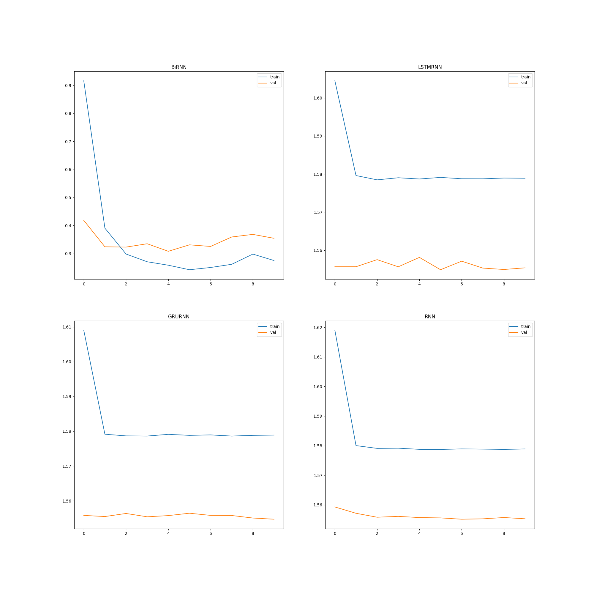

# EMOJII

Emojii is a machine learning project focused on emotion classification using Recurrent Neural Networks (RNNs). The project's main objective is to predict and assign appropriate emojis to text input based on the emotions conveyed by the text. This repository contains the code, dataset, and description.

## Model Architecture
I decided to use 4 architectures type Recurrent Neural Networks:

Long Short-Term Memory (LSTM) 

Gated recurrent unit (GRU)

Basic Recurrent neural network (RNN)

Bidirectional Long Short-Term Memory (BiLSTM)

## Dataset

The Emojii model was trained on dataset from https://huggingface.co/datasets/dair-ai/emotion version of splitted data. Total number of 20k examples, were divided into training set 16k, 3,2k validation set and 800 test set.

## Limits
Model was trained only for emotes:

😥

😂

❣️ 

😠

😨

😯

The Emojii project has a lot of potential for expansion, especially in exploring a wider range of emojis and their applications

## Training

Text input is tokenized, stop words removed, stemmed, embedded, and fed into the LSTM layers. The final output layer generates probabilities for each emoji class, and the emoji with the highest probability is chosen as the prediction.
(I tried to use a prepared and trained model GloVe 6B tokens, 400K vocab, 100d(https://nlp.stanford.edu/projects/glove/) for word embedding, but got lower accuracy)

### Accuracy plot

### Loss plot

## Results

The Bidirectional LSTM model achieved the highest accuracy, approximately 98%, on the test set, while the other models had low accuracy, around 33%. The next step is to improve the performance of the other models through parameter tuning and architectural changes.

## Inspiration 
Inspiration from a key concept covered in the "Deep Learning" course on Coursera, specifically from the assignment in Week 2 that focused on sequence models.
